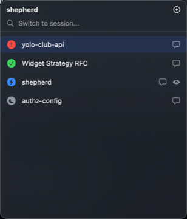
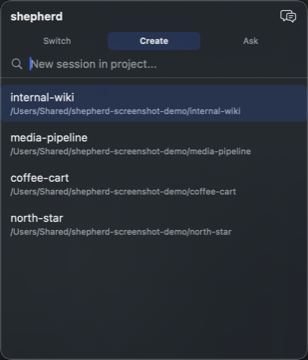
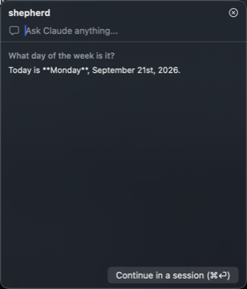

# shepherd

A native macOS menu-bar app for [Herdr](https://herdr.dev), a terminal workspace manager for AI coding agents. Herdr shows you which of your agent sessions need attention, but only while you're looking at a terminal. shepherd answers "which of my agents need me?" at a glance from the menu bar, and lets you switch to, create, or quickly ask something of a session without ever opening a terminal.

## What it does

- **Menu bar dashboard** — the icon shows your worst-case attention state across all sessions (blocked/done/working/idle/unknown) at a glance. Click it to see the full list.
- **Quick switcher** — press a global hotkey (Hyper+W by default, configurable) from any app to pop up a searchable panel and jump straight to a session, fully keyboard-driven.
- **Project picker** — from the same panel, fuzzy-search your projects (frecency-ranked) and start a new session in one, instead of hunting for the right directory.
- **Inline quick-answer** — type a question directly into the panel and get an answer without switching to a terminal at all. If the question turns out to need real work, shepherd spawns a real session for it automatically and sends your question in.
- **Peek** — press → on a selected session to see what's currently on its screen before deciding whether to switch to it.
- **Notifications** — get notified when a session becomes blocked or finishes, so you don't have to keep the panel open to watch for it. Toggle on/off from the menu bar.

## Screenshots


The menu bar icon (a red badge here means a session is blocked and needs you):



The quick switcher — jump to any session, or create a new one:



The inline quick-answer panel — ask a question without opening a terminal:



*(All session/project names above are sanitized demo data, not real projects.)*

## Icon guide

**Attention badges** — the colored circle on each session row (and the menu bar icon, which shows the worst one across all sessions):

| Icon | Meaning |
|---|---|
| 🔴 exclamation | **Blocked** — the agent is waiting on you (a question, a permission prompt) |
| 🟢 checkmark | **Done** — the agent finished and is waiting for you to look |
| 🔵 bolt | **Working** — the agent is actively running |
| ⚪️ moon | **Idle** — nothing pending, not currently doing anything |
| ⚪️ question mark | **Unknown** — Herdr hasn't reported a status yet |

**Row icons**, on the right of each session:

- **Speech bubble** — send a one-off prompt to that session without switching to it.
- **Eye** — this is the session currently focused in the terminal.

**Peek** — in the switcher, press → on the selected row to see what's currently on that session's screen without switching to it; ← or Esc goes back to the list.

**Mode tabs** (top of the panel) — the highlighted tab is the panel's current mode; click any tab to jump straight there, or press Tab to cycle through them in order:

- **Switch** — jump to an existing session.
- **Create** — start a new session in a project.
- **Ask** — get a quick answer inline, without opening a session at all.

**Header button** (top-right of the panel, also triggered by Tab) — a shortcut that cycles to the *next* mode, whose icon previews where it'll take you:

- **+** (in Switch) → Create.
- **Speech bubbles** (in Create) → Ask.
- **×** (in Ask) → back to Switch.

## Menu bar options

Right-click the menu bar icon for:

- **Install Hooks…** / **Uninstall Hooks…** — installs Claude Code hooks that let shepherd distinguish *why* a session is blocked (a plain question vs. a permission prompt) and show todo progress while idle, richer than what Herdr's socket alone reports.
- **Change Hotkey…** — set the quick-switcher's global hotkey (see [Configuration](#configuration)).
- **Launch at Login** — toggle starting shepherd automatically at login.
- **Notifications** — toggle desktop notifications on/off (see [Configuration](#configuration)).
- **Quit Shepherd**.

## Configuration

`~/.config/shepherd/config.json` (created with defaults on first launch):

```json
{
  "projects": { "directories": ["~/dev"], "exclude": [] },
  "hotkey": { "switchSession": "hyper+w" },
  "notifications": { "enabled": true }
}
```

**Hotkey naming convention** — `hotkey.switchSession` is a string of `+`-separated tokens, all lowercase, modifiers first then exactly one key:

- **Modifiers** (any combination, in any order): `cmd`, `shift`, `opt`, `ctrl` — or `hyper` as shorthand for all four at once (Cmd+Ctrl+Opt+Shift).
- **Key** (exactly one, last): a single letter (`a`-`z`) or digit (`0`-`9`), `space`, `tab`, `return`, `escape`, `delete`, or `f1`-`f12`.

Examples: `"hyper+w"` (the default), `"cmd+shift+k"`, `"ctrl+opt+space"`. An unrecognised token or a missing/duplicate key falls back to Hyper+W, logged to Console.

You can edit this field directly, or change it from the app: right-click the menu bar icon → **Change Hotkey…**. That applies the new binding immediately (no restart) and writes it back to the config file.

`notifications.enabled` toggles whether shepherd posts a notification on blocked/done transitions — also available as a checkbox in the same right-click menu (**Notifications**). Turning it off doesn't revoke the OS-level permission, so re-enabling it later never needs a fresh authorization prompt.

## Dependencies

- **macOS 14+**
- **[Herdr](https://herdr.dev)** — shepherd talks to Herdr's local socket API; it has no functionality without a running Herdr instance.
- **[Claude Code CLI](https://claude.com/claude-code)** (`claude`) on your `PATH` — used both for the sessions Herdr manages and for shepherd's own inline quick-answer feature.
- **Swift 6 toolchain** (Xcode 16+) to build from source. No third-party Swift package dependencies.

## Getting started

```bash
swift build
swift test
swift run Shepherd -- --fake   # runs against seeded demo data, no Herdr required
```

To install as a real menu-bar app:

```bash
scripts/install.sh
```

This builds a release binary, assembles `Shepherd.app`, ad-hoc code-signs it, and installs it to `/Applications`.
