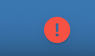
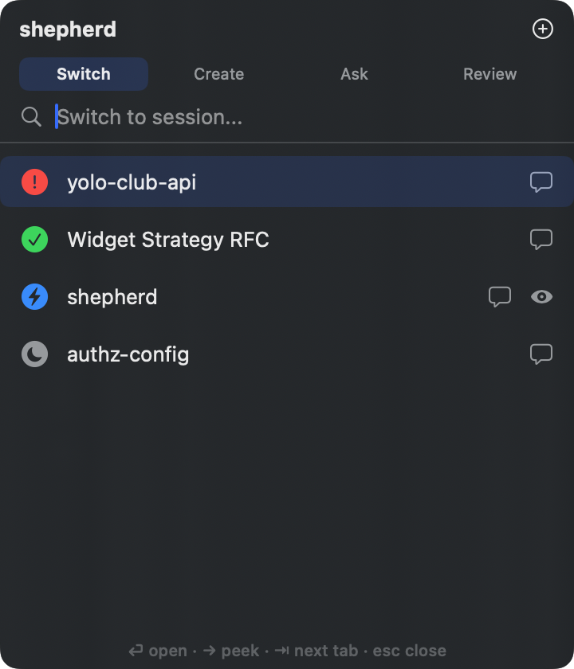
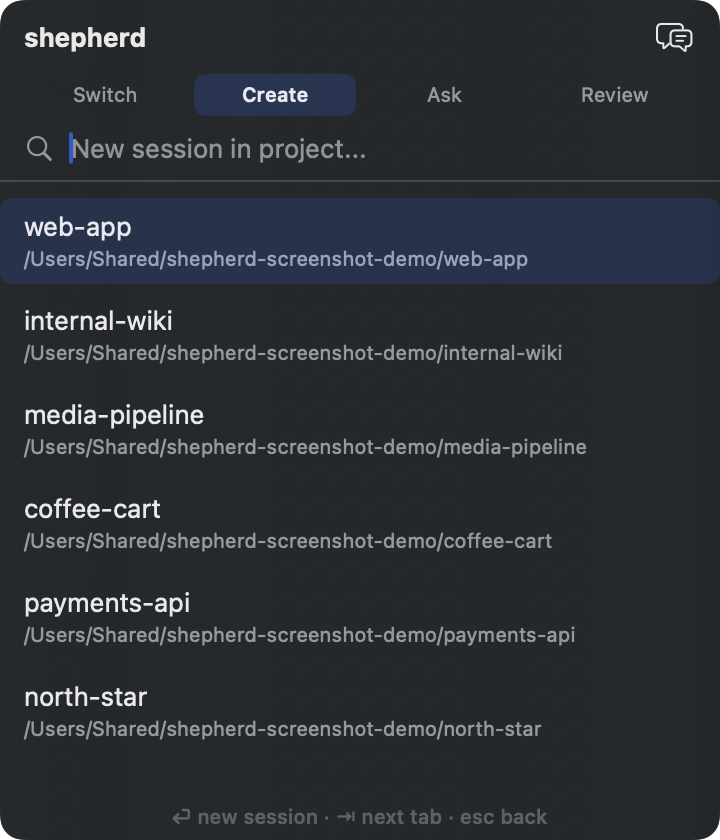
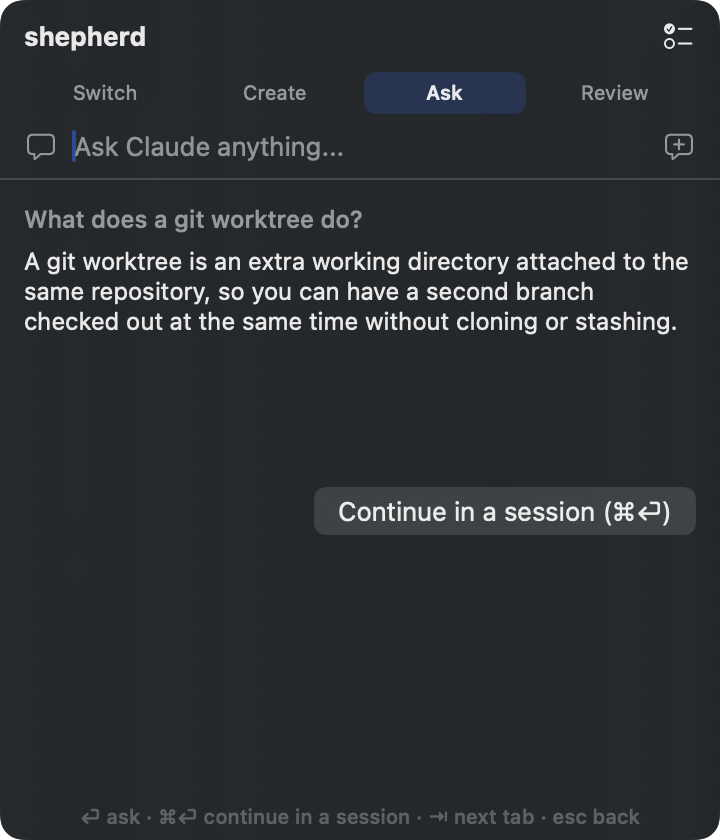
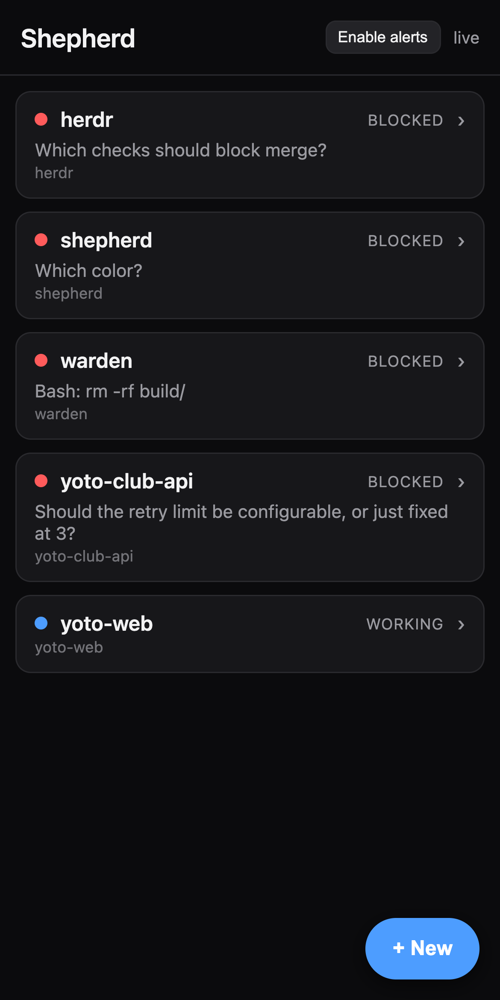
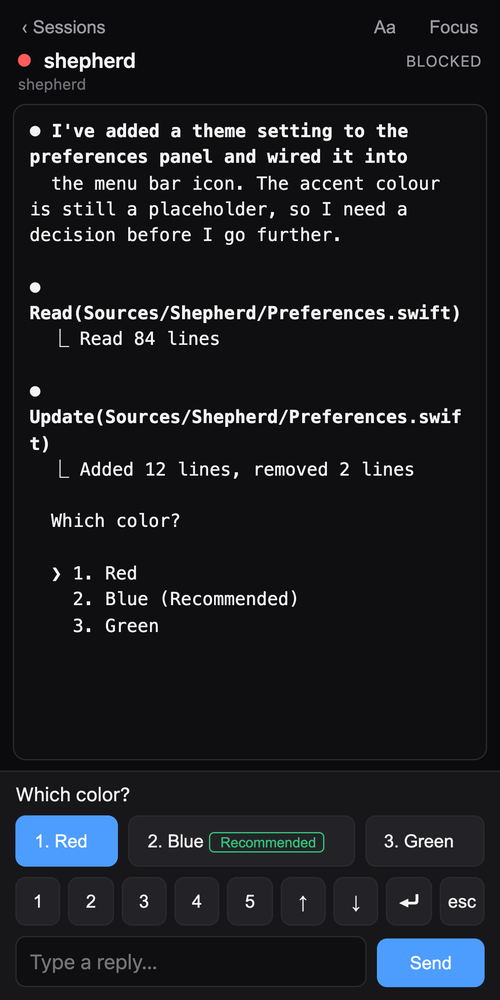

# shepherd

A native macOS menu-bar app for [Herdr](https://herdr.dev), a terminal workspace manager for AI coding agents. Herdr shows you which of your agent sessions need attention, but only while you're looking at a terminal. shepherd answers "which of my agents need me?" at a glance from the menu bar, and lets you switch to, create, or quickly ask something of a session without ever opening a terminal — and, from your phone, answer a blocked agent without being at your Mac at all.

## What it does

- **Menu bar dashboard** — the icon shows your worst-case attention state across all sessions (blocked/done/working/idle/unknown) at a glance. Click it to see the full list.
- **Quick switcher** — press a global hotkey (Hyper+W by default, configurable) from any app to pop up a searchable panel and jump straight to a session, fully keyboard-driven.
- **Project picker** — from the same panel, fuzzy-search your projects (frecency-ranked) and start a new session in one, instead of hunting for the right directory.
- **Inline quick-answer** — type a question directly into the panel and get an answer without switching to a terminal at all. If the question turns out to need real work, shepherd spawns a real session for it automatically and sends your question in. The conversation stays put if you switch to another tab and back; click the bubble icon in the search bar, or press Hyper+N, to start a fresh one.
- **Peek** — press → on a selected session to see what's currently on its screen before deciding whether to switch to it.
- **Review** — a fourth tab lists PRs you're a requested reviewer on (via `gh`), each with its review status and check counts (matching GitHub's own PR list), that match a repo you already have cloned locally. Picking one creates an isolated git worktree for that PR's branch and starts a session in it, so an agent can review it or answer questions about it without touching whatever's already checked out in your normal clone. Bot-authored PRs (Dependabot/Renovate, etc.) are excluded by default; not reviewing one yourself? Press Delete or click the eye-slash icon to dismiss it for good. Only covers repos you've already cloned somewhere shepherd scans (`projects.directories`) — a PR in a repo you haven't cloned won't show up yet.
- **Notifications** — get notified when a session becomes blocked or finishes, so you don't have to keep the panel open to watch for it. Toggle on/off from the menu bar.
- **Mobile access** — answer blocked sessions, read what an agent said, reply, and start new sessions from your phone, with push notifications when an agent needs you. Needs [Tailscale](https://tailscale.com) (see [Mobile access](#mobile-access)).

## Screenshots



The menu bar icon (a red badge here means a session is blocked and needs you):



The quick switcher — jump to any session, or create a new one:



The inline quick-answer panel — ask a question without opening a terminal:



*(All session/project names above are sanitized demo data, not real projects.)*

## Icon guide

**Attention badges** — the colored circle on each session row (and the menu bar icon, which shows the worst one across all sessions):

| Icon | Meaning |
|---|---|
| 🔴 exclamation | **Blocked** — the agent is waiting on you (a question, a permission prompt) |
| 🟢 checkmark | **Done** — the agent finished and is waiting for you to look |
| 🔵 bolt | **Working** — the agent is actively running |
| ⚪️ moon | **Idle** — nothing pending, not currently doing anything |
| ⚪️ question mark | **Unknown** — Herdr hasn't reported a status yet |

**Row icons**, on the right of each session:

- **Speech bubble** — send a one-off prompt to that session without switching to it.
- **Eye** — this is the session currently focused in the terminal.

**Peek** — in the switcher, press → on the selected row to see what's currently on that session's screen without switching to it; ← or Esc goes back to the list.

**Mode tabs** (top of the panel) — the highlighted tab is the panel's current mode; click any tab to jump straight there, or press Tab to cycle through them in order:

- **Switch** — jump to an existing session.
- **Create** — start a new session in a project.
- **Ask** — get a quick answer inline, without opening a session at all.
- **Review** — start a session reviewing a PR you've been asked to review.

**Header button** (top-right of the panel, also triggered by Tab) — a shortcut that cycles to the *next* mode, whose icon previews where it'll take you:

- **+** (in Switch) → Create.
- **Speech bubbles** (in Create) → Ask.
- **Checklist** (in Ask) → Review.
- **×** (in Review) → back to Switch.

## Menu bar options

Right-click the menu bar icon for:

- **Install Hooks…** / **Uninstall Hooks…** — installs Claude Code hooks that let shepherd distinguish *why* a session is blocked (a plain question vs. a permission prompt) and show todo progress while idle, richer than what Herdr's socket alone reports.
- **Change Hotkey…** — set the quick-switcher's global hotkey (see [Configuration](#configuration)).
- **Terminal** — a submenu to pick which terminal app shepherd raises after switching to a session (Ghostty, Terminal, or iTerm2), applied immediately.
- **Agent** — a submenu to pick which agent CLI new sessions get started with (Claude Code or OpenCode), applied immediately.
- **Mobile Access…** — set up and manage the phone view (see [Mobile access](#mobile-access)).
- **Change Default Directory…** — pick where the Ask tab's escalated/promoted sessions get created (see [Configuration](#configuration)).
- **Launch at Login** — toggle starting shepherd automatically at login.
- **Notifications** — toggle desktop notifications on/off (see [Configuration](#configuration)).
- **Quit Shepherd**.

## Mobile access

Answer an agent that's blocked on a permission prompt or a question, read what it said, send it a message, and start new sessions — from your phone, with a push notification when an agent needs you. It runs inside Shepherd and reaches your phone through [Tailscale](https://tailscale.com) (free for personal use), which gives you a private, encrypted address with HTTPS and tells Shepherd which account is calling.

### New to Tailscale?

Tailscale links your own devices into a private network (a "tailnet"). The short version of what Shepherd needs:

1. **Create an account and install Tailscale on your Mac** — [download](https://tailscale.com/download), then sign in.
2. **Install Tailscale on your phone** (App Store / Play Store) and sign in with the *same* account.
3. **Turn on HTTPS certificates** — in the [admin console's DNS page](https://login.tailscale.com/admin/dns), make sure MagicDNS is on, then under **HTTPS Certificates** choose **Enable HTTPS**. Tailscale will ask you to acknowledge that your machines' names appear in a public certificate log; rename a machine first if its name is sensitive. You don't need to run `tailscale cert` yourself — Shepherd publishes through `tailscale serve`, which handles the certificate.

That's all of it; the Mobile Access window below checks each step and tells you what's left. For the full story, see Tailscale's own [quickstart](https://tailscale.com/kb/1017/install), [enabling HTTPS](https://tailscale.com/kb/1153/enabling-https), and [Serve](https://tailscale.com/kb/1247/funnel-serve-use-cases) docs.

### Set it up

Right-click the menu bar icon → **Mobile Access…**, then switch on **Enable mobile access**. The window is a checklist that turns green as you go, and updates by itself while you're off doing the next step:

1. **Tailscale is installed** on this Mac — the button takes you to the download.
2. **Signed in** to Tailscale.
3. **HTTPS certificates are turned on** — a one-time switch in Tailscale's admin console (DNS page → HTTPS Certificates → Enable). Shepherd can't flip this for you; the window links straight to it.
4. **Shared on your Tailscale network** — Shepherd does this itself. It never replaces a `tailscale serve` setup you already have; if port 443 is taken it uses 8443 instead.

Then the window shows a QR code and the steps for your phone:

1. Install Tailscale on your phone and sign in with the same account.
2. Scan the QR code and open the page in Safari.
3. **Share → Add to Home Screen**, then open Shepherd from your Home Screen. (iOS only offers push notifications to a page that's been added to the Home Screen. These steps were written for an iPhone; Android hasn't been tried.)
4. Tap **Turn on alerts**. The Mobile Access window has a **Send test notification** button to check it.

Installing the Claude Code hooks (right-click menu → **Install Hooks…**) is worth doing first: it's what lets Shepherd show the actual question, the labelled choices, and what a permission prompt is asking to run. Without them you still get the raw screen to read.

### What you can do from the phone

 

*The session list, and a blocked session with its choices as buttons (demo data, not real projects).*

- **The session list** — every session with its status, summary and project; blocked ones first.
- **A full-screen session view** — the session's latest output (refreshed every couple of seconds, with terminal clutter tidied), its model and usage in the header, and a reply box pinned above the keyboard. **Aa** changes the text size.
- **One-tap answers** — permission prompts and questions show their real options as buttons, including multiple-choice (tick, then Submit). Unnumbered dialogs can be driven with the arrow/Enter/Esc keys. A button built from the screen's text re-checks the screen first and refuses to send if it changed under you.
- **+ New** — start a session in your default folder or any of your projects (the same ones the Create tab lists), with an optional first message.
- **Push notifications** — when a session becomes blocked or finishes, even with the app closed. Tapping one opens that session.

### Security

The server listens on this Mac's loopback address only, so nothing on your network can reach it directly. The only way in is `tailscale serve`, which stamps each request with the caller's Tailscale account; Shepherd accepts only your own account (a device someone shared into your tailnet is refused) and refuses Tailscale Funnel (public internet) traffic outright. It also refuses requests that originate from other websites in your browser (it checks the `Host`, `Origin` and fetch-metadata headers and only accepts JSON bodies), so a page you happen to visit can't send it commands, and it caps request sizes and times out stalled connections. Anyone who passes the identity check can approve permission prompts and type into your agents, so treat access to your tailnet accordingly. It's off until you switch it on, and new sessions can only be started in your default folder or your configured project folders.

### Things to know

- It only works while Shepherd is running — the window has a toggle to open it at login. If Shepherd quits, the phone shows an error until it's back.
- By default Shepherd keeps the Mac awake while any session is working or waiting on you, so agents keep running and a blocked one can be answered from your phone. Closing a laptop's lid still sleeps it. You can turn this off in the window.
- Phone alerts follow the same rules as the Mac's (a session blocking or finishing), plus one more: a session going from working to idle also alerts your phone, since Herdr reports a run you've already looked at as idle rather than done. The Mac's **Notifications** toggle doesn't affect the phone. **Don't alert my phone while I'm looking at my terminal** (on by default) holds alerts back only while you're active *and* your terminal (the one chosen under **Terminal** in the menu) is the frontmost app. In any other app, or after a couple of minutes without keyboard or mouse input, alerts come through; a session still waiting when you switch away is sent then. Turn it off to always get them. It can't tell which Herdr pane you're looking at, only that the terminal is in front.
- The Mobile Access window lists the phones that have alerts on, with when each was last seen and a **Remove** button — use it to clear an old phone or a deleted Home Screen app. Phones not seen for 90 days are dropped automatically (opening Shepherd on a dropped phone brings it back).
- Turning mobile access off stops the server and removes the Tailscale share it created.
- The address is part of the phone app's identity: if you rename the machine or tailnet, re-add it to the Home Screen and turn alerts on again.

### Troubleshooting

- **The checklist is stuck on a step** — it re-checks every few seconds. "Signed in" needs Tailscale running and connected; "HTTPS certificates" needs the admin-console switch above.
- **"Couldn't start on port …"** — something else is using the port (often the standalone `ShepherdWeb` service from `scripts/install-web.sh`). Stop it, or change `web.port` in the config.
- **No "Enable alerts" button on the phone** — on iOS it only appears once the page is opened from the Home Screen, not from a Safari tab.
- **A test notification reaches no phone** — open Shepherd on the phone and tap **Turn on alerts** first; check notifications are allowed for it in the phone's Settings.
- **The window lists a phone you no longer use** — press **Remove** next to it. (Re-adding Shepherd to the Home Screen creates a new entry and leaves the old one behind until you remove it.)
- **The page won't load on the phone** — check Tailscale is connected on both devices and that the address in the Mobile Access window opens.
- **The page looks old after an update** — close the Home Screen app fully and reopen it (once more if it still looks stale).

Design notes, the security model in detail, and known gaps: [docs/mobile-access.md](docs/mobile-access.md).

## Configuration

`~/.config/shepherd/config.json` (created with defaults on first launch):

```json
{
  "projects": { "directories": ["~/dev"], "exclude": [] },
  "hotkey": { "switchSession": "hyper+w" },
  "notifications": { "enabled": true },
  "terminal": { "appName": "Ghostty" },
  "sessions": { "defaultDirectory": "~" },
  "review": { "includeBots": false, "hideOlderThanDays": null },
  "agent": { "kind": "claude" },
  "web": { "enabled": false, "port": 8787, "keepAwake": true, "alertsOnlyWhenAway": true }
}
```

**Hotkey naming convention** — `hotkey.switchSession` is a string of `+`-separated tokens, all lowercase, modifiers first then exactly one key:

- **Modifiers** (any combination, in any order): `cmd`, `shift`, `opt`, `ctrl` — or `hyper` as shorthand for all four at once (Cmd+Ctrl+Opt+Shift).
- **Key** (exactly one, last): a single letter (`a`-`z`) or digit (`0`-`9`), `space`, `tab`, `return`, `escape`, `delete`, or `f1`-`f12`.

Examples: `"hyper+w"` (the default), `"cmd+shift+k"`, `"ctrl+opt+space"`. An unrecognised token or a missing/duplicate key falls back to Hyper+W, logged to Console.

You can edit this field directly, or change it from the app: right-click the menu bar icon → **Change Hotkey…**. That applies the new binding immediately (no restart) and writes it back to the config file.

`notifications.enabled` toggles whether shepherd posts a notification on blocked/done transitions — also available as a checkbox in the same right-click menu (**Notifications**). Turning it off doesn't revoke the OS-level permission, so re-enabling it later never needs a fresh authorization prompt.

`terminal.appName` is which app shepherd brings to the front (via AppleScript `activate`) after switching to a session — defaults to `"Ghostty"`. Rather than editing this by hand (iTerm2's actual AppleScript name is `"iTerm"`, not `"iTerm2"` — it's literally `iTerm.app` under the hood, easy to get wrong as free text), pick it from the right-click menu's **Terminal** submenu, which only offers verified-correct names and applies immediately, no restart. Only AppleScript-scriptable terminals are supported (Ghostty, Terminal, iTerm2); GPU terminals like Alacritty, kitty, and WezTerm aren't.

`sessions.defaultDirectory` is where the inline quick-answer panel's escalated/promoted sessions get created — defaults to `"~"`. Set it to `"~/dev"` (or wherever your projects live) for better context/memory of prior work, either by editing the field directly or via the right-click menu's **Change Default Directory…** (a native folder picker), which applies immediately, no restart.

`review.includeBots` shows bot-authored PRs (Dependabot, Renovate, etc.) in the Review tab instead of hiding them — off by default. `review.hideOlderThanDays` hides PRs whose last update is older than N days — off (`null`) by default, since silently hiding a real long-open PR without being asked could surprise. Explicitly-ignored PRs (pressing Delete on a row, or the eye-slash icon) are tracked separately in `~/.config/shepherd/ignored-prs.json`; delete entries from that file to bring a PR back.

`agent.kind` is which agent CLI new sessions get started with — the project picker, Review-tab sessions, and the Ask tab's escalated/promoted sessions. Defaults to `"claude"`; set to `"opencode"` to use [OpenCode](https://opencode.ai) instead (via the right-click menu's **Agent** submenu, or by editing the field directly). **OpenCode support is experimental** — blocked-reason detail (needs permission vs. needs an answer) and idle todo-progress aren't wired up for it yet, so those sessions only ever show a plain "blocked"/"idle" badge. The Ask tab itself always answers via the Claude Code CLI regardless of this setting and is disabled when `"opencode"` is selected — see [Dependencies](#dependencies).

`web` is the [mobile access](#mobile-access) server: `enabled` (off by default — turning it on is what opens the server), `port` (the local loopback port it listens on; config-only), `keepAwake`, and `alertsOnlyWhenAway` (on by default). All but `port` are also switches in the Mobile Access window.

## Dependencies

- **macOS 14+**
- **[Herdr](https://herdr.dev)** — shepherd talks to Herdr's local socket API; it has no functionality without a running Herdr instance.
- **[Claude Code CLI](https://claude.com/claude-code)** (`claude`) on your `PATH` — used both for the sessions Herdr manages and for shepherd's own inline quick-answer feature.
- **[OpenCode](https://opencode.ai)** (`opencode`) on your `PATH`, with `herdr integration install opencode` run at least once — only needed if you set `agent.kind` to `"opencode"` (experimental, see [Configuration](#configuration)).
- **[GitHub CLI](https://cli.github.com)** (`gh`), authenticated, on your `PATH` — used by the Review tab. Optional otherwise.
- **[Tailscale](https://tailscale.com)** — only needed for [mobile access](#mobile-access). Optional otherwise.
- **Swift 6 toolchain** (Xcode 16+) to build from source. No third-party Swift package dependencies.

## Getting started

**Install.** Download `Shepherd.zip` from the project's Releases page, unzip it, and drag `Shepherd.app` to `/Applications`. (It's ad-hoc signed rather than notarized, so the first launch needs right-click → Open, or `xattr -cr /Applications/Shepherd.app` if macOS still blocks it.) Or build and install from source:

```bash
scripts/install.sh
```

This builds a release binary, assembles `Shepherd.app` (including the phone view's web assets), ad-hoc code-signs it, and installs it to `/Applications`.

**First run**, in this order:

1. Make sure Herdr is running, then open Shepherd — a small icon appears in the menu bar.
2. Right-click the icon → **Install Hooks…** (richer blocked-reason detail, and the question/choice text the phone view shows).
3. Optional: right-click → **Launch at Login**.
4. Optional: right-click → **Mobile Access…** to set up the [phone view](#mobile-access).

Then press **Hyper+W** (Cmd+Ctrl+Opt+Shift+W) for the quick switcher; change it under **Change Hotkey…**.

## Development

```bash
swift build
swift test                       # one live-integration test depends on a real Herdr's state and can fail on its own
swift run Shepherd -- --fake     # the menu bar app against seeded demo data, no Herdr required
```

Package layout — dependencies point downward, and there are no third-party Swift packages:

| Target | What it is |
|---|---|
| `ShepherdCore` | Domain model, the `SessionBackend` protocol, config. Knows nothing about Herdr or AppKit. |
| `ShepherdHerdr` | The Herdr socket adapter and Claude Code hook-state parsing. |
| `ShepherdUI` | View models and SwiftUI views, plus the shared notification policy. Depends only on Core. |
| `ShepherdWebKit` | The phone view's server (HTTP, API, push, Tailscale setup) and its web client in `Public/`. |
| `Shepherd` | The menu bar app. Hosts the server and the Mobile Access window. |
| `ShepherdWeb` | A thin standalone harness over `ShepherdWebKit`. |

To work on the phone view without the whole app:

```bash
swift run ShepherdWeb --fake --port 8788    # demo sessions; open http://localhost:8788
swift run Shepherd -- --fake --show-mobile-access   # the app, with the Mobile Access window open
```

The server serves a copied resource bundle, so rebuild after editing `Sources/ShepherdWebKit/Public/`. `scripts/install-web.sh` can run the phone server as its own always-on LaunchAgent (headless use); don't run it alongside the in-app one. Tailscale-dependent behaviour needs a real Tailscale install to try end to end. More in [docs/mobile-access.md](docs/mobile-access.md).
